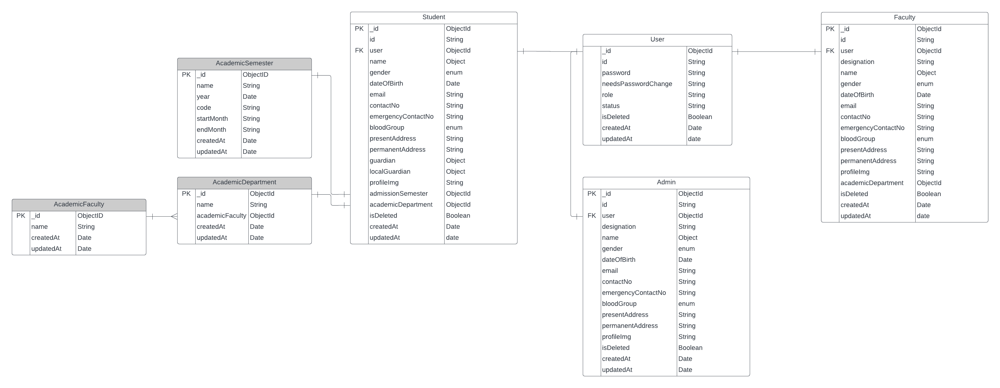

# University Managment System (backend)

## Requirement Analysis and Entity-Relationship (ER) Diagram

([Requirement Analysis - 👈 Click Here](https://docs.google.com/document/d/10mkjS8boCQzW4xpsESyzwCCLJcM3hvLghyD_TeXPBx0/edit?usp=sharing))

_Description_: This document represents the requirement analysis of part-1.

## Entity-Relationship (ER) Diagram

_Description_: This diagram represents the entities and their relationships in the system.

Description: This is an updated diagram illustrates the relationships among User, Student, Admin, Faculty, Academic Semester, Academic Faculty, Academic Department.

---

